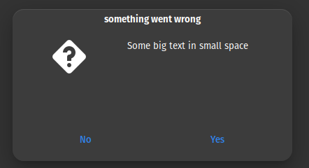
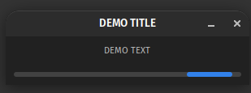
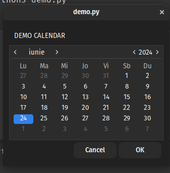

[](https://badge.fury.io/gh/SoftGeekRO%2Fsgzenity)
[](https://badge.fury.io/py/sgzenity)
[](https://github.com/SoftGeekRO/sgzenity/actions/workflows/push_to_main.yml)
[](https://github.com/SoftGeekRO/sgzenity/actions/workflows/publish_to_pypi.yml)


# SGZenity

SGZenity is a library for python which was inspired by Zenity.

When you write scripts, you can use SGZenity to create simple dialogs that interact graphically with the user.

## Requirements

* Python 3
* [GTK+4](https://docs.gtk.org/)
* python3-gi

## Installation

Install using pip:

```bash
$ pip install sgzenity
```

Or clone the repo:

```bash
$ git clone https://github.com/SoftGeekRo/sgzenity.git
$ cd ./sgzenity
$ python setup.py install
```

## Example

Simple dialog:

## API

### Simple message
```python
message(title='', text='', width=330, height=120, timeout=None)
```
>Display a simple message
> 
>Parameters:
>* **text** (*str*) – text inside the window
>* **title** (*str*) – title of the window
>* **width** (*int*) – window width
>* **height** (*int*) – window height
>* **timeout** (*int*) – close the window after n seconds

### Error

```python
error(title='', text='', width=330, height=120, timeout=None)
```

>Display a simple error
>
>Parameters:
>* **text** (*str*) – text inside the window
>* **title** (*str*) – title of the window
>* **width** (*int*) – window width
>* **height** (*int*) – window height
>* **timeout** (*int*) – close the window after n seconds

### Warning
```python
warning(title='', text='', width=330, height=120, timeout=None)
```
>Display a simple warning
>
>Parameters:
>* **text** (*str*) – text inside the window
>* **title** (*str*) – title of the window
>* **width** (*int*) – window width
>* **height** (*int*) – window height
>* **timeout** (*int*) – close the window after n seconds

### Question



```python
question(title='', text='', width=330, height=120, timeout=None)
```
>Display a question, possible answer are yes/no.
>
>Parameters:
>* **text** (*str*) – text inside the window
>* **title** (*str*) – title of the window
>* **width** (*int*) – window width
>* **height** (*int*) – window height
>* **timeout** (*int*) – close the window after n seconds
>
>_Returns_: The answer as a boolean
>
>_Return type_: bool

### Progress Bar



```python
progress_bar(title, text, pulse_mode, callback)
```

> Display a text input
>
>Parameters:
>* **title** (*str*) – Title of the progress window
>* **text** (*str*) – Text that will be present on top of the progress bar
>* **pulse_mode** (*bool*) – Character of the progress bar, pulse of progress based on the callback returns values from 0.0 to 1
>* **callback** (*int*) – callback function for control the progress bar. Returns a value between 0.0 and 1


### Demo

```python
import time
from sgzenity.thread import WorkerThread
from sgzenity import ProgressBar

class WorkingThread(WorkerThread):
    def payload(self):
        loading = self.data
        steps = 10
        for s in range(steps):
            if self.stop:
                break
            loading.heartbeat()
            print('Pulse {}.'.format(s))
            time.sleep(1)
        if self.stop:
            print('Working thread canceled.')
        else:
            print('Working thread ended.')
        loading.close()


def sg_progress_bar():
    loading = ProgressBar("DEMO TITLE", "DEMO TEXT", pulse_mode=True)

    workthread = WorkingThread(loading)
    loading.show(workthread)
    workthread.start()

    Gtk.main()


sg_progress_bar()
```

### Entry
```python
entry(text='', placeholder='', title='', width=330, height=120, timeout=None)
```
>Display a text input
>
>Parameters:
>* **text** (*str*) – text inside the window
>* **placeholder** (*str*) – placeholder for the input
>* **title** (*str*) – title of the window
>* **width** (*int*) – window width
>* **height** (*int*) – window height
>* **timeout** (*int*) – close the window after n seconds
>
>_Returns_: The content of the text input
>_Return type_: str

### Password
```python
password(text='', placeholder='', title='', width=330, height=120, timeout=None)
```
>Display a text input with hidden characters
>
>Parameters:
>* **text** (*str*) – text inside the window
>* **placeholder** (*str*) – placeholder for the input
>* **title** (*str*) – title of the window
>* **width** (*int*) – window width
>* **height** (*int*) – window height
>* **timeout** (*int*) – close the window after n seconds
>
>Returns: The content of the text input
>
>Return type: str

### List of values
```python
zlist(columns, items, print_columns=None, text='', title='', width=330, height=120, timeout=None)
```
>Display a list of values
>
>Parameters:
>* **columns** (*list of strings*) – a list of columns name
>* **items** (*list of strings*) – a list of values
>* **print_columns** (*int** (**None if all the columns**)*) –
>  index of a column (return just the values from this column)
>* **text** (*str*) – text inside the window
>* **title** (*str*) – title of the window
>* **width** (*int*) – window width
>* **height** (*int*) – window height
>* **timeout** (*int*) – close the window after n seconds
>
>_Returns_: A row of values from the table
>
>_Return type_: list

### File selection
```python
file_selection(multiple=False, directory=False, save=False, confirm_overwrite=False, filename=None, title='', width=330, height=120, timeout=None)
```
>Open a file selection window
>
>Parameters:
>* **multiple** (*bool*) – allow multiple file selection
>* **directory** (*bool*) – only directory selection
>* **save** (*bool*) – save mode
>* **confirm_overwrite** (*bool*) – confirm when a file is overwritten
>* **filename** (*str*) – placeholder for the filename
>* **text** (*str*) – text inside the window
>* **title** (*str*) – title of the window
>* **width** (*int*) – window width
>* **height** (*int*) – window height
>* **timeout** (*int*) – close the window after n seconds
>
>_Returns_: path of files selected.
>
>_Return type_: string or list if multiple enabled

### Calendar

```python
calendar(text='', day=None, month=None, title='', width=330, height=120, timeout=None)
```
>Display a calendar
>
>Parameters:
>* **text** (*str*) – text inside the window
>* **day** (*int*) – default day
>* **month** (*int*) – default month
>* **text** – text inside the window
>* **title** (*str*) – title of the window
>* **width** (*int*) – window width
>* **height** (*int*) – window height
>* **timeout** (*int*) – close the window after n seconds
>
>_Returns_: (year, month, day)
> 
>_Return type_: tuple



And display the result :

```bash
$ python demo.py
$ (year=2017, month=6, day=4)
```

### Color selection

```python
color_selection(show_palette=False, opacity_control=False, title='', width=330, height=120, timeout=None)
```

>Display a color selection dialog
>
>Parameters:
>* **show_palette** (*bool*) – hide/show the palette with preselected colors
>* **opacity_control** (*bool*) – allow to control opacity
>* **title** (*str*) – title of the window
>* **width** (*int*) – window width
>* **height** (*int*) – window height
>* **timeout** (*int*) – close the window after n seconds
>
>_Returns_: the color selected by the user
>
>_Return type_: str

### Scale

```python
scale(text='', value=0, min=0, max=100, step=1, draw_value=True, title='', width=330, height=120, timeout=None)
```

>Select a number with a range widget
>
>Parameters:
>* **text** (*str*) – text inside window
>* **value** (*int*) – current value
>* **min** (*int*) – minimum value
>* **max** (*int*) – maximum value
>* **step** (*int*) – incrementation value
>* **draw_value** (*bool*) – hide/show cursor value
>* **title** (*str*) – title of the window
>* **width** (*int*) – window width
>* **height** (*int*) – window height
>* **timeout** (*int*) – close the window after n seconds
>
>_Returns_: The value selected by the user
>
>_Return type_: float
